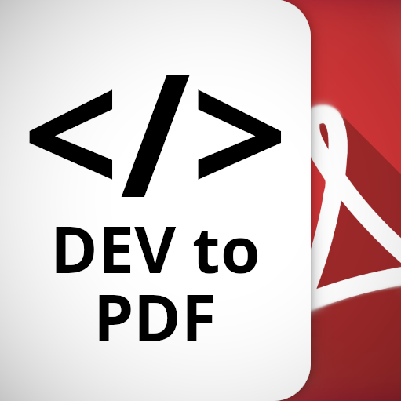

# [Dev.to](https://dev.to) Community Content-to-PDF Creator

This extension allows you to create PDFs from the content of your favorite Dev.to community articles.

## Compatible Browsers

- Google Chrome and Chromium derivatives

## Usage

Extension is accessible in;

- [Chrome Web Store](https://chromewebstore.google.com/detail/dev-community-content-to/nmnfmgnebdkhboackclnhecbcjhhflak)
- Microsoft Edge Add-on Store **(pending)**

On the other hand, if you want to run the extension locally, follow these steps:

1. Clone the repository (or download the source code)
2. Unpack the extension by going in your browser:
   - Manage Extensions > Turn on Developer Mode > Click "Load Unpacked"
3. Enjoy!

## Dependencies

- `Bootstrap 5.3.3`
- `html2canvas 1.4.1`
- `html2pdf 0.10.1`
- `jsPDF 2.5.1`
